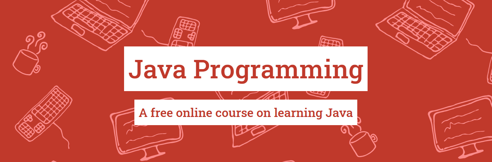

### Repo for projects done while studying Java on [University of Helsinki’s](https://java-programming.mooc.fi/) massive open online course

#### During this course, I learned the basics of computer programming, along with algorithms and object-oriented programming through the Java programming language. 
#### Curriculum can be found on the website linked above. 
